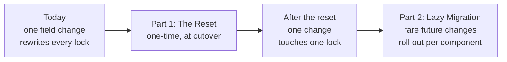

# Schema Migration - Executive Summary

> A two-page summary of the RFC [Lock-File Fingerprint Reset and Lazy Schema Migration](../rfc/lazy-schema-migration.md).
> Audience: reviewers and decision-makers. Read this first; drill into the linked summaries for detail.

## In one paragraph

`azldev` records each software component's build inputs in a per-component "lock file," stamped with a content
**fingerprint**. Today, adding a single new configuration field re-fingerprints **every** component - even ones that
never use the new field - so a one-line change rewrites every lock file and triggers a distro-wide rebuild. A one-time,
distro-wide rebuild is **already scheduled** (the dev-to-prod cutover). This RFC proposes spending that single, already-
paid rebuild to replace the fingerprinting foundation with one where, afterward, a change to one component touches
exactly **one** lock file - and where rare future foundation changes roll out gradually, per component, with no second
coordinated event.

## The problem

- A lock file changes whenever its fingerprint moves, and the fingerprint hashes the **whole shape** of a component's config.
- Adding any field changes that shape for every component, because "field present but empty" is treated differently from "field absent." So **every** lock drifts at once.
- Effect: pull requests become unreviewable (hundreds of changed lock files), `git blame` stops meaning anything, and "this lock changed" stops being a trustworthy signal.
- The same all-or-nothing pain blocks ordinary maintenance: renaming a field, removing one, changing a default, or fixing a bug in the hashing logic.
- The obvious fix - keep old hashing algorithms around and "replay" them to tell a real input change from a cosmetic one - **does not work** on today's hashing library, because an "old" algorithm secretly tracks the live code and shifts under you. The RFC calls this the *substrate problem*.

## The opportunity

The cutover rebuild is sanctioned and unavoidable. Treat it as a **budget**: spend it once on the irreversible
foundation work, then make everything afterward free or lazy. The whole "avoid a mass rebuild" framing inverts the
moment exactly one mass rebuild is already on the calendar.

## The solution: two parts

- **Part 1 - The Reset** (one-time, rides the scheduled rebuild). Swap the foundation to a **canonical projection**: fingerprint only the fields each version explicitly lists, written in a frozen, checked-in form. Do every one-way-door cleanup at the same time. After this, an unused new field changes no other lock, *by construction*. See [Part 1 - The Reset](part-1-the-reset.md).
- **Part 2 - Lazy Migration** (afterward, no second cutover). Stamp a version into each lock. For a genuine future algorithm change, "replay" the lock's own version to check whether its real inputs moved; if not, quietly re-stamp the lock with **no rebuild**. Locks migrate one at a time, only when touched for a real reason. See [Part 2 - Lazy Migration](part-2-lazy-migration.md).

## What we get

| Goal | Plain meaning |
| ---- | ------------- |
| G1 | After the reset, no lock file changes unless that component really changed. |
| G2 | A lock moves only on a genuine input change. |
| G3 | Future upgrades happen gradually, per component, never as a big-bang. |
| G4 | Adding an unused field is free - no other lock moves. |
| G5 | The tool never silently skips a rebuild that is actually needed. |
| G6 | Old lock files stay readable across the full git history. |

## What it costs

- A one-time mass rebuild at the cutover. This is **already scheduled** - not new cost - but it is the single sanctioned exception to "no mass rebuilds."
- New things to own: a small projection encoder plus a "golden vector" test set now, and a code generator as a fast follow.
- "Lazy forever" means retired algorithm versions accumulate. A planned, occasional cleanup pass (`component migrate`) keeps the backlog bounded.
- A few choices become irreversible at the reset (the on-disk version token and its byte encoding). They must be right the first time, so the RFC pins them up front.

## Decisions requested

1. Approve the two-part approach, with the Reset riding the already-scheduled dev-to-prod cutover.
2. Approve spending the free rebuild on the listed irreversible changes: the foundation swap, hash-format unification, and any pending field renames / default cleanups. See the [reset load-out](part-1-the-reset.md#the-reset-load-out).
3. Confirm the deliberate trade-offs the RFC ratifies: a single opaque version token (rather than a per-field record), and lazy-forever migration backed by periodic cleanup.

## Open questions

- Config schema version: tracked **per file** or **per component**? Per-file is simpler; per-component allows mixed-version projects during a future migration.

## Read next

| Doc | What it covers |
| --- | -------------- |
| [Problem & Motivation](problem-and-motivation.md) | Why this matters, in plain terms, and why the obvious fix fails. |
| [Part 1 - The Reset](part-1-the-reset.md) | The one-time cutover and exactly what the free rebuild buys. |
| [Part 2 - Lazy Migration](part-2-lazy-migration.md) | How rare future changes roll out per component with no rebuild. |
| [Delivery Plan](delivery-plan.md) | The PR sequence and what gates what. |
| [Full RFC](../rfc/lazy-schema-migration.md) | The complete technical design and decision record. |
