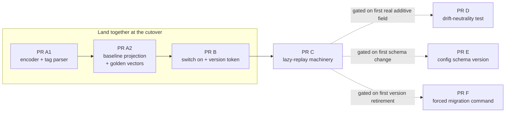

# Delivery Plan

> Summary of how the work ships. Part of the [Schema Migration summary set](README.md).
> Source: [RFC, Incremental delivery](../rfc/lazy-schema-migration.md#incremental-delivery).

## Shape of the rollout

The work lands as a sequence of independently reviewable pull requests. The dividing line is the **cutover**: a few PRs
must land together there (they all move the hash and are absorbed by the scheduled rebuild), and the rest are gated on a
real future need so nothing ships speculatively.

## The pull requests

| PR | What it does | When it lands |
| -- | ------------ | ------------- |
| **A1** | The canonical encoder, the field-selection tag parser, and the hash combiner. Pure mechanism, no behavior change yet. | At the cutover |
| **A2** | The baseline projection plus its golden-vector tests and completeness checks. Added alongside the old path, not yet switched on. | At the cutover |
| **B** | The switch-flip: turn on the new foundation, adopt the self-describing version token, unify the hash format. | At the cutover |
| **C** | The lazy-migration machinery: the version registry, replay, and the typed token that routes every comparison safely. Dormant until the first genuine algorithm change. | After the cutover |
| **D** | A drift-neutrality test proving a real new field changes only its own lock. | Gated on the first real additive field |
| **E** | The on-disk config schema version plus a `config migrate` command. | Gated on the first schema change not already handled by the reset |
| **F** | The `component migrate` command that force-advances locks so an old version can be retired. | Gated on the first version retirement |

## What gates what

- **A1, A2, B land together** at the dev-to-prod cutover. They all move the hash, so they ride the one scheduled rebuild.
- **PR C** can merge any time after the cutover, but its replay logic stays dormant until the first real algorithm change needs it.
- **PRs D, E, F do not ship preemptively.** Each is gated on a concrete future need, so the team builds them when they are actually required rather than on speculation.
- **The deferred designs are provisional.** PRs C-F and the code generator capture our current best thinking, not a frozen contract. When each is actually built, its specifics are open to re-design against the requirements that hold then - the RFC keeps the full analysis so the reset forecloses nothing, but only the cutover PRs (A1, A2, B) are committed in detail.

## The code generator: a fast follow

At the cutover the baseline projection is **hand-written**, backed by the golden-vector tests. A code generator that
produces the projection from field tags is a **fast follow** after the cutover - prioritized so it does not drag, but
explicitly **not** a blocker. Hand-written code already unblocks additive schema changes; the generator's first job can
simply be to reproduce the hand-written baseline exactly, proven against the same golden vectors.

This ordering is deliberate: it keeps the foundation swap small and low-risk, and it means an undetected encoding slip at
the reset is recoverable by shipping a corrected version later - not a permanent problem.

## Reversibility

Every PR is independently revertible up to the cutover. After the cutover, two choices are intentionally locked in - the
on-disk version token and its byte encoding - which is why the RFC pins them up front and guards them with tests.
