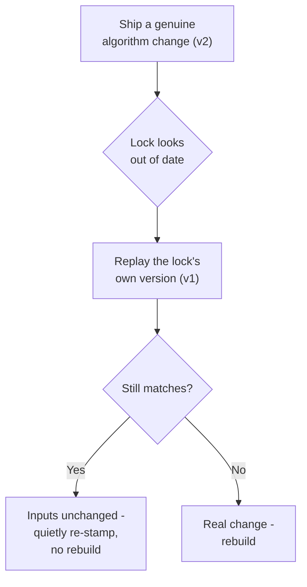

# Part 2 - Lazy Migration

> Summary of how rare future changes roll out after the reset. Part of the [Schema Migration summary set](README.md).
> Source: [RFC, Part 2: Post-reset lazy migration](../rfc/lazy-schema-migration.md#part-2-post-reset-lazy-migration).
>
> **Status: deferred and provisional.** None of this is built at the reset; it is not needed until the first genuine post-reset algorithm change (a rare event). The high-level blocks below - version stamp, replay-to-decide-freshness, lazy per-component rollout, bounded backlog - are stable enough to plan around and to keep the reset from foreclosing them. But the *implementation specifics* (the version registry, the typed token, the resolution axis, the floor/ceiling/`component migrate` controls, and the code generator) are **open to re-design when each is actually built.** Treat this as direction, not a committed spec.

## The idea

The [reset](part-1-the-reset.md) gives us a clean foundation where old hashing algorithms are genuinely frozen. Part 2
is the machinery that rides that foundation for the **rare genuine algorithm change** after the cutover - gradually, per
component, with **no second coordinated event**.

Two moves make it work:

1. **Stamp a version into every lock** (the `v1:` part of the `v1:sha256:...` token).
2. **Replay the old version to decide freshness.** When a lock looks out of date, recompute the hash using the lock's *own* recorded version. If that still matches, the inputs are unchanged and only the algorithm moved - so accept the lock and quietly re-stamp it, with **no rebuild**. If it genuinely differs, the component really changed and rebuilds.

## How a change rolls out

Migration is **lazy and opportunistic**. A lock advances to the new version the next time its component changes for a
real reason - and not one commit sooner. An untouched component can sit at an old version indefinitely; that is by
design, and it is correct, because replaying its own version faithfully answers "did anything I measure actually change?"

## What happens to each kind of change

Most changes never need Part 2 at all - the projection foundation makes them free. Part 2 only carries the genuinely
hard cases.

| Change | Outcome |
| ------ | ------- |
| Add an unused field | **Free.** No version bump, no other lock moves. |
| Add a field with a non-zero default | **Bump + replay.** Old locks replay clean and re-stamp lazily; no rebuild. |
| Rename or move a field | **Free** in the common case (the stored key is frozen); no rebuild. |
| Fix a bug in the hashing logic | **Bump + replay.** Unchanged components re-stamp lazily. |
| Start measuring a new input | **Bump + replay.** Lazy adoption by default; force it sooner if the input is build-critical. |
| Genuinely change build meaning | **Rebuilds, correctly.** The output really differs, so the lock *should* move. |

## Avoiding new churn

The version stamp could itself become a source of noisy diffs - the exact thing we are trying to prevent. One rule
avoids it: **judge "changed?" by replaying the lock's own version, not the current one.** A lock is only re-stamped when
it is already being written for a real reason, so a version upgrade always piggybacks a genuine change and never triggers
one on its own.

The honest flip side: while a lock sits at an old version, replay is blind to any input that version did not measure. For
a cosmetic input that is harmless; for a **build-critical** new input, do not rely on lazy adoption - pair the change
with a deliberate migration pass (below).

## Keeping the backlog bounded

Because locks can stay at old versions indefinitely, old algorithm versions accumulate. Two controls keep this safe:

- **A version floor.** The tool keeps every algorithm version down to a declared floor. Dropping a version below the floor is a deliberate, announced act - never incidental cleanup.
- **A forced-migration command** (`component migrate`). This advances every lock to the current version in one deliberate, reviewed pass. It is the only sanctioned way to retire an old version: migrate the fleet first, then raise the floor. This pass is rare and planned - it is the post-reset equivalent of the reset's sanctioned exception.

A CI ceiling keeps the gap between the newest and oldest supported version small, so the cleanup backlog cannot grow
unbounded between planned rebuilds.

## A note on the second hash

Each lock carries a second hash for upstream-resolution inputs. It has the same evolution problem but no pending change,
so the RFC uses **one version axis today** (the fingerprint) and reserves a separate axis for the resolution hash for the
day it first changes. This is a deliberate "don't build it until it is needed" choice that forecloses nothing.
